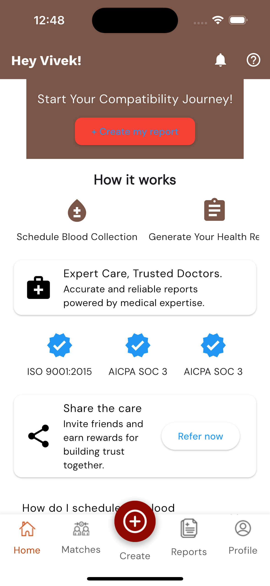
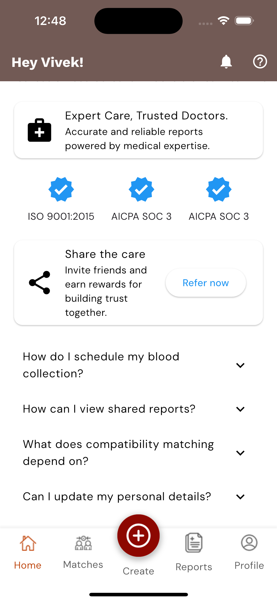
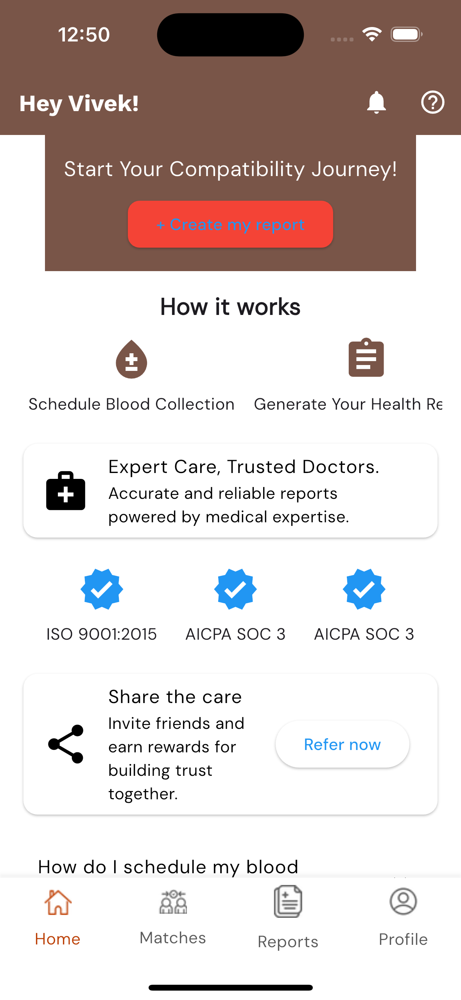

# ids_bottom_nav_bar_example

A new Flutter project.

## Getting Started

## Use this package as a library


https://pub.dev/packages/ids_material_sdk/install

### Depend on it

Run this command:

#### With Flutter:
```sh
flutter pub add ids_material_sdk
```

This will add a line like this to your package's `pubspec.yaml` (and run an implicit `flutter pub get`):

```yaml
dependencies:
  ids_material_sdk: ^3.0.1
```

Alternatively, your editor might support `flutter pub get`. Check the docs for your editor to learn more.

### Import it

Now in your Dart code, you can use:

```dart
import 'package:ids_material_sdk/ids_material_sdk.dart';
```

## Example screenshots

|  |  |  |  |  |
|---|---|---|---|---|

## When we don't need the middle button on bottom nav bar, do the following changes 

```dart
class DashboardPage extends StatefulWidget {
  const DashboardPage({super.key});

  @override
  DashboardPageState createState() => DashboardPageState();
}

class DashboardPageState extends State<DashboardPage> {
  int _selectedIndex = 0;
  final GlobalKey<IDSBottomNavigationAppBarState> _bottomNavBarKey =
      GlobalKey<IDSBottomNavigationAppBarState>();

  final List<Widget> _pages = [
    HomePage(),
    Center(child: Text("Matches Page")),
    Center(child: Text("Create Page")),
    Center(child: Text("Reports Page")),
    Center(child: Text("Profile Page")),
  ];

  void _onItemTapped(int index) {
    setState(() {
      _selectedIndex = index;
    });
  }

  @override
  Widget build(BuildContext context) {
    return Scaffold(
      body: _pages[_selectedIndex],
      // Middle floating action button
      // floatingActionButton: Padding(
      //   padding: const EdgeInsets.only(left: 0, top: 20, right: 0, bottom: 0),
      //   child: IDSFloatingActionButton(
      //     onPressed: () {
      //       print("Middle FAB pressed");
      //       // Navigator.push(
      //       //   context,
      //       //   MaterialPageRoute(builder: (context) => TaskPage()),
      //       // );
      //     },
      //     isSelected: false,
      //     activeColor: AppColors.tabActiveColor,
      //     inactiveColor: AppColors.tabActiveColor,
      //     icon: Image.asset('assets/images/tabs/tab_create.png'),
      //     enableShadow: true,
      //   ),
      // ),
      // floatingActionButtonLocation: FloatingActionButtonLocation.centerDocked,

      // Custom Bottom Navigation Bar
      bottomNavigationBar: IDSBottomNavigationAppBar(
        key: _bottomNavBarKey,
        items: [
          IDSBottomNavBarItem(
            activeIcon: Image.asset('assets/images/tabs/tab_home_selected.png'),
            inActiveIcon: Image.asset('assets/images/tabs/tab_home_normal.png'),
            text: 'Home',
          ),
          IDSBottomNavBarItem(
            activeIcon:
                Image.asset('assets/images/tabs/tab_matches_selected.png'),
            inActiveIcon:
                Image.asset('assets/images/tabs/tab_matches_normal.png'),
            text: 'Matches',
          ),
          IDSBottomNavBarItem(
            activeIcon:
                Image.asset('assets/images/tabs/tab_report_selected.png'),
            inActiveIcon:
                Image.asset('assets/images/tabs/tab_report_normal.png'),
            text: 'Reports',
          ),
          IDSBottomNavBarItem(
            activeIcon:
                Image.asset('assets/images/tabs/tab_profile_selected.png'),
            inActiveIcon:
                Image.asset('assets/images/tabs/tab_profile_normal.png'),
            text: 'Profile',
          ),
        ],
        centerItemText: 'Create',
        backgroundColor: AppColors.tabBgColor,
        activeColor: AppColors.tabActiveColor,
        inActiveColor: AppColors.tabInActiveColor,
        enableMiddleTabItem: false, // Enable middle tab and FAB
        onTabSelected: (index) {
          print("Selected index: $index");
          setState(() {
            _selectedIndex = index; // Update the selected tab index
          });
        },
      ),
    );
  }
}
```
## Screenshots
|  |  |  |
|----------------------------------------|----------------------------------------|----------------------------------------|