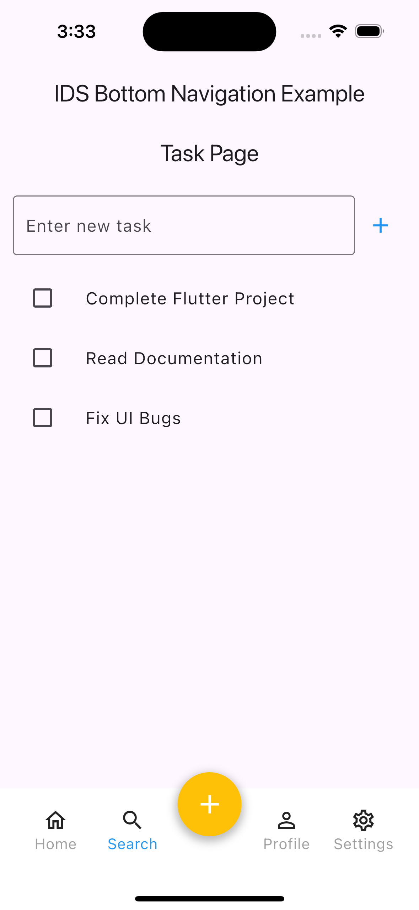
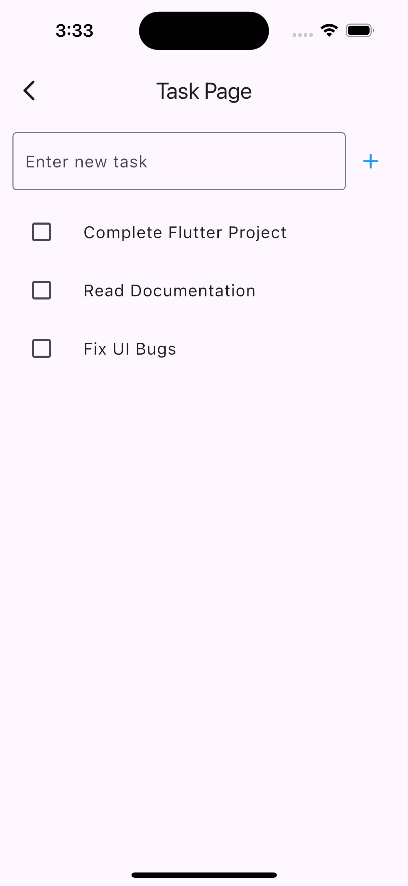
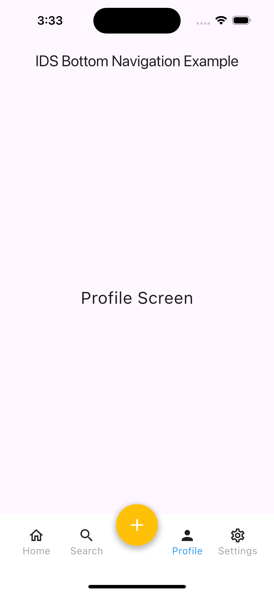
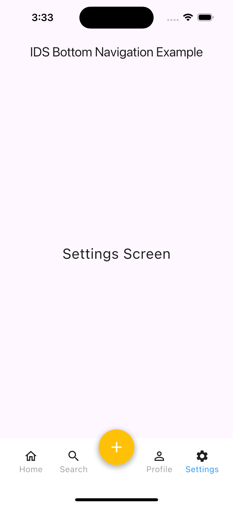

# ids_bottom_nav_bar_example

A new Flutter project.

## Getting Started

## Use this package as a library

https://pub.dev/packages/ids_material_sdk/install

### Depend on it

Run this command:

#### With Flutter:
```sh
flutter pub add ids_material_sdk
```

This will add a line like this to your package's `pubspec.yaml` (and run an implicit `flutter pub get`):

```yaml
dependencies:
  ids_material_sdk: ^2.8.8
```

Alternatively, your editor might support `flutter pub get`. Check the docs for your editor to learn more.

### Import it

Now in your Dart code, you can use:

```dart
import 'package:ids_material_sdk/ids_material_sdk.dart';
```

## Example screenshots

|  |  |  |  |  |
|---|---|---|---|---|


